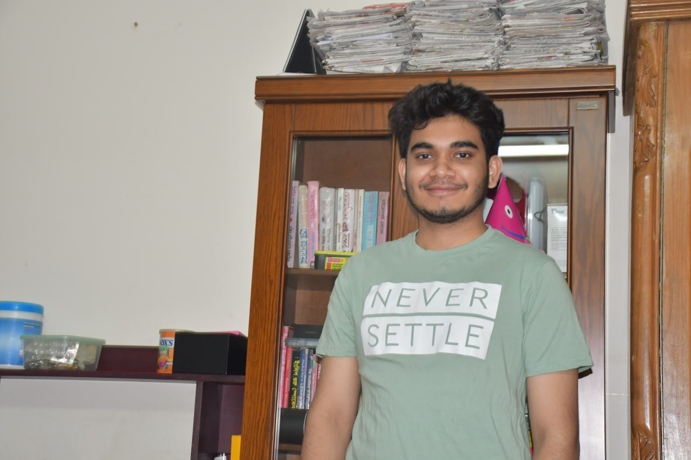

## Personal Information

**Name:** Hasibul Hamim  
**Address:** House # 25/14 Lovely House, Flat # 4C, Road #3/A Munsibari Road, Jhigatola, Dhaka-1209.  
**Phone:** +8801732312998  
**Email:** hasibulhamim2020@gmail.com  

## Special Qualification

- Capable of taking on responsibilities, hard worker, and quick learner.
- Advanced computer skills with proficiency in various applications and software.
- Motivational and inspiring, creating a positive work environment.
- Effective communication skills, both written and verbal.
- Skilled in problem-solving and innovative solutions.

## Academic Qualification

- **B.Sc. (Engineering)**
  - Dhaka International University
  - Department: CSE
  - Result: 3.82 out of 4.00

- **HSC (Higher Secondary Certificate)**
  - Board: Dhaka
  - Institute: Ideal College, Dhanmondi
  - Result: 4.25 out of 5.00
  - Year of Passing: 2019

- **SSC (Secondary School Certificate)**
  - Board: Comilla
  - Institute: Comilla Modern High School
  - Result: 4.91 out of 5.00
  - Year of Passing: 2017

## Interests

- Technology enthusiast with a passion for advancements in software and gadgets.
- Creative individual with a talent for various artistic pursuits, including painting, writing, music, or photography.
- Curious and open-minded traveler who seeks new experiences and embraces diverse cultures.

## Technical Skills

- **Languages:** HTML, C++, Java (OOP), JavaScript, Python, DBMS.
- **Operating System:** Windows.
- **Others:** MS-Office, Adobe Photoshop.

## Training Summary

| Sl No | Training Title                              | Institute                     | Location    | Country    | Year | Duration  |
|-------|--------------------------------------------|-------------------------------|-------------|------------|------|-----------|
| 01    | Advance English Certificate Course          | Dhaka International University | Dhaka       | Bangladesh | 2023 | 03 Months |
| 02    | Complete Web Development Course with Jhankar Mahbub | Programming Hero               | N/A         | Bangladesh | 2022 | 06 Months |

## Personal Details

- **Gender:** Male
- **Marital Status:** Single
- **Nationality:** Bangladeshi
- **Religion:** Islam
- **Blood Group:** A+ve

## Language Proficiency

- **Bangla:** Fluent in Reading, Writing & Speaking
- **English:** Fluent in Reading, Writing & Speaking

I certify that, to the best of my knowledge and belief, the information contained in this resume is accurate, truthful, and comprehensive.
